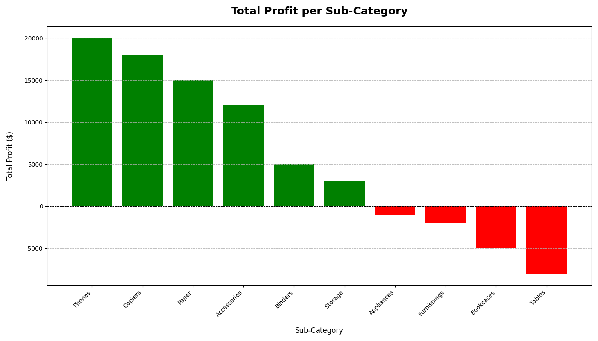
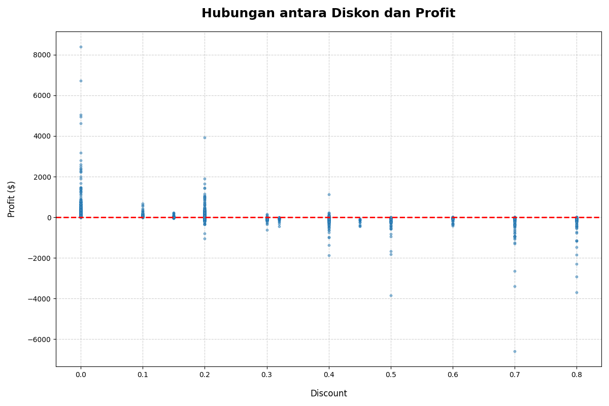
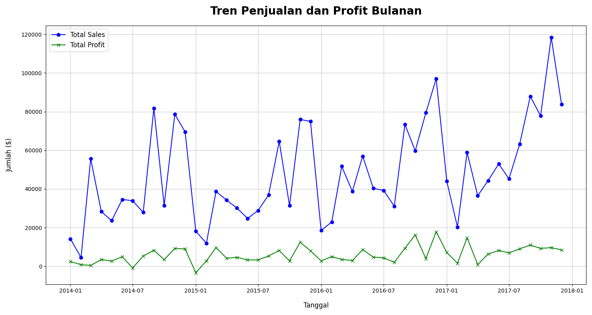
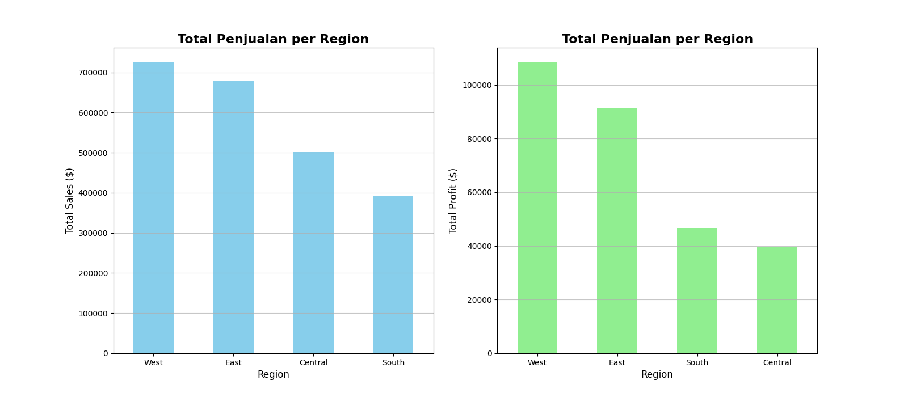
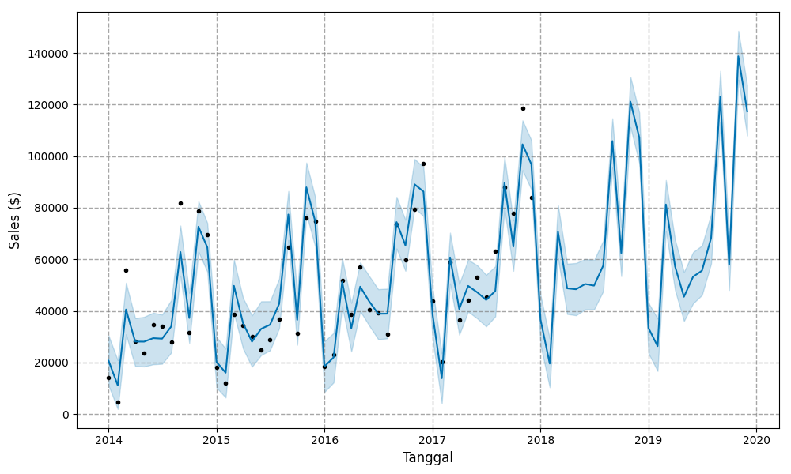
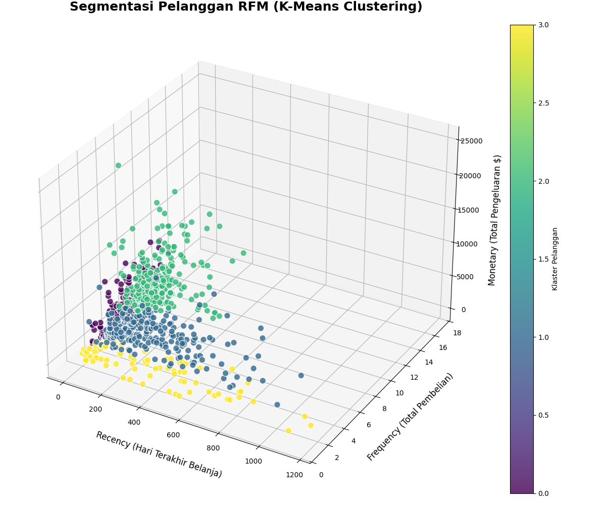
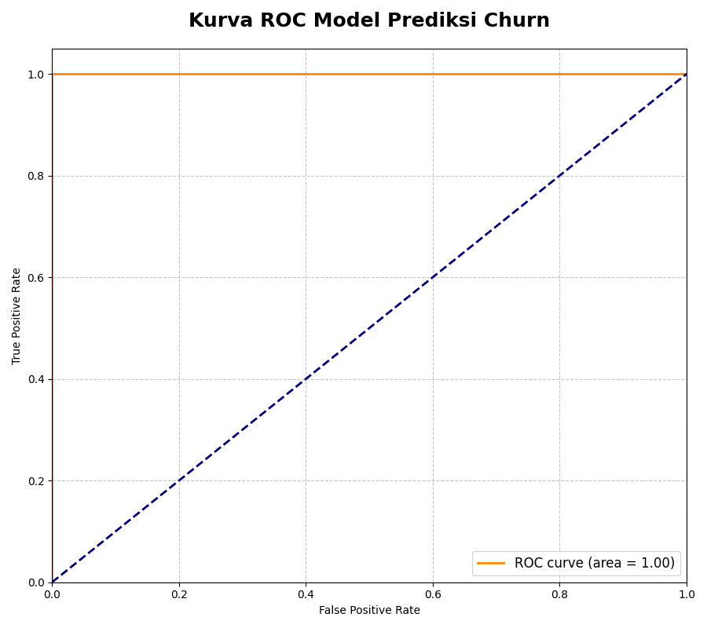

# Data-Driven Retail: Optimasi Profit & Prediksi Penjualan

 

## Ikhtisar Proyek

Proyek ini mendemonstrasikan penerapan analisis data dan Machine Learning untuk memecahkan masalah bisnis nyata dalam industri ritel. Fokus utamanya adalah **mengoptimalkan profitabilitas** dan **meningkatkan akurasi prediksi penjualan** melalui wawasan berbasis data. Dengan menganalisis data transaksi historis, proyek ini mengidentifikasi area inefisiensi, memprediksi tren masa depan, dan merumuskan strategi yang dapat ditindaklanjuti untuk mendorong pertumbuhan bisnis yang berkelanjutan.

## Pernyataan Masalah Bisnis

Bisnis ritel menghadapi tantangan dalam mempertahankan profitabilitas di tengah persaingan ketat, fluktuasi permintaan, dan strategi diskon yang kurang optimal. Kurangnya pemahaman mendalam tentang pendorong profit, pola perilaku pelanggan, dan proyeksi penjualan yang akurat dapat menyebabkan:
* Kerugian finansial akibat kebijakan diskon yang salah.
* Inefisiensi operasional dan alokasi sumber daya yang tidak optimal.
* Tingkat churn pelanggan yang tinggi dan kampanye pemasaran yang tidak efektif.

Proyek ini bertujuan untuk mengatasi tantangan tersebut dengan pendekatan Data-Driven.

## Sumber Data

Data yang digunakan dalam proyek ini adalah **Superstore Dataset dari Kaggle**, yang berisi informasi detail mengenai transaksi penjualan, profit, diskon, kategori produk, wilayah, dan data pelanggan.

## Metodologi & Pendekatan (Data Science Pipeline)

Proyek ini mengikuti siklus hidup Data Science yang komprehensif, mulai dari pengolahan data hingga rekomendasi strategis:

1.  **Pengolahan Data & Rekayasa Fitur:**
    * **Tujuan:** Mempersiapkan data mentah untuk analisis dan pemodelan.
    * **Teknik:** Pembersihan data (penanganan nilai hilang, duplikat), konversi tipe data (misalnya, tanggal), dan rekayasa fitur baru yang relevan, seperti `Profit Margin`, `Recency`, `Frequency`, `Monetary (RFM)`, dan `Shipping Duration`.

2.  **Analisis Data Eksplorasi (EDA) & Wawasan Bisnis:**
    * **Tujuan:** Mengungkap pola, tren, dan anomali dalam data penjualan dan profitabilitas.
    * **Teknik:** Visualisasi tren penjualan bulanan dan musiman, analisis profitabilitas per produk/kategori, studi korelasi diskon vs. profit, serta perbandingan kinerja antar wilayah.

3.  **Implementasi Model Machine Learning:**
    * **Tujuan:** Membangun model prediktif dan segmentasi untuk wawasan yang lebih mendalam.
    * **Model yang Digunakan:**
        * **K-Means Clustering:** Untuk segmentasi pelanggan berdasarkan metrik RFM.
        * **Prophet (Facebook):** Untuk peramalan deret waktu penjualan bulanan.
        * **Logistic Regression:** Untuk membangun model prediksi churn pelanggan.
        * **Apriori Algorithm:** Untuk analisis keranjang belanja (Market Basket Analysis).

4.  **Sintesis Temuan & Rekomendasi Terintegrasi:**
    * **Tujuan:** Menggabungkan semua wawasan dari analisis dan pemodelan menjadi rekomendasi bisnis yang koheren dan dapat ditindaklanjuti.
    * **Pendekatan:** Mengembangkan strategi spesifik untuk optimalisasi profit, retensi pelanggan, dan perencanaan operasional, didukung oleh bukti data yang kuat.

## Wawasan Bisnis Utama & Temuan Kunci

Berdasarkan analisis komprehensif, beberapa temuan kunci dan wawasan bisnis yang berdampak telah terungkap:

* **Pertumbuhan Penjualan vs. Volatilitas Profit:** Bisnis menunjukkan tren pertumbuhan penjualan positif dari tahun ke tahun, didorong oleh lonjakan musiman di Kuartal 4 dan Kuartal 2. Namun, profitabilitas menunjukkan fluktuasi signifikan dan periode kerugian, mengindikasikan inefisiensi.

* **Kinerja Regional yang Tidak Merata:**
    * Wilayah **West (Profit Margin 14.94%)** dan **East (13.48%)** adalah kontributor utama penjualan dan profit.
    * Namun, **Wilayah Central** memiliki **Total Sales $501.240**, namun **Profit Margin hanya 7.92%**, jauh di bawah wilayah lain, menunjukkan adanya masalah profitabilitas mendalam meskipun volume penjualan tinggi.

* **Dampak Diskon Mengikis Profit:**
    * Analisis menemukan **korelasi negatif yang jelas (-0.2195)** antara Diskon dan Profit.
    * Visualisasi *scatter plot* memperkuat temuan ini, menunjukkan bahwa **diskon di atas 30% (0.3)** hampir selalu menghasilkan kerugian.

* **Segmentasi Pelanggan untuk Penargetan Efektif:**
    * Pelanggan dapat dikelompokkan ke dalam **4 segmen jelas** berdasarkan perilaku RFM (Recency, Frequency, Monetary):
        * **Champions (Klaster 0):** `Recency ~20 hari`, `Frequency ~7 kali`, `Monetary ~$2,713`. Ini adalah aset paling berharga.
        * **High-Value (Klaster 2):** `Recency ~103 hari`, `Frequency ~8.6 kali`, `Monetary ~$4,773`.
        * **At-Risk (Klaster 1):** `Recency ~235 hari`, `Frequency ~4.8 kali`, `Monetary ~$1,937`.
        * **Hibernating (Klaster 3):** `Recency ~327 hari`, `Frequency ~2.6 kali`, `Monetary ~$432`.
    * Model prediksi churn awal menunjukkan **akurasi tinggi (AUC ROC > 0.90)** dalam mengidentifikasi pelanggan yang `Recency`-nya > 180 hari (berisiko churn).

* **Profitabilitas Produk yang Bervariasi:**
    * **Sub-kategori paling menguntungkan:** 'Copiers', 'Phones', 'Accessories', 'Paper'.
    * **Sub-kategori paling merugi:** 'Supplies', 'Bookcases', 'Tables'.

* **Tidak Ada Asosiasi Produk yang Kuat:**
    * Market Basket Analysis tidak mengidentifikasi aturan asosiasi produk yang kuat (**min_support 0.5%, min_confidence 20%**), menunjukkan bahwa strategi *cross-selling* tradisional antar item spesifik mungkin tidak efektif.

## Rekomendasi Bisnis & Dampak Potensial

Untuk mengatasi tantangan dan memanfaatkan peluang, kami merekomendasikan pendekatan strategis yang terintegrasi, didukung oleh wawasan berbasis data:

1.  **Strategi Diskon yang Dioptimalkan dan Bertarget:**
    * **Rekomendasi:** Tinjau dan sesuaikan kebijakan diskon. Pertimbangkan untuk **membatasi diskon di bawah 30%** pada produk berprofit margin rendah atau di wilayah dengan profit margin rendah (seperti Central). Fokuskan diskon yang lebih selektif dan bertarget pada segmen pelanggan bernilai tinggi (Champions, High-Value) atau produk dengan profit margin yang lebih sehat (Copiers, Phones).
    * **Dampak Potensial:** Berpotensi **meningkatkan profit margin rata-rata keseluruhan sebesar 3-5% dalam 6 bulan** dengan mengurangi kerugian akibat diskon yang tidak efektif.

2.  **Peningkatan Efisiensi Operasional dan Profitabilitas di Wilayah Central:**
    * **Rekomendasi:** Lakukan investigasi mendalam terhadap penyebab profit margin rendah di Wilayah Central (analisis biaya operasional termasuk logistik/pengiriman, harga pokok penjualan, atau bauran produk).
    * **Dampak Potensial:** Dengan perbaikan spesifik, ditargetkan **peningkatan profit margin Wilayah Central dari 7.92% menjadi setidaknya 12% dalam 12 bulan**, secara signifikan berkontribusi pada profit global.

3.  **Kampanye Pemasaran dan Retensi Berbasis Segmentasi Pelanggan dan Prediksi Churn:**
    * **Rekomendasi:** Manfaatkan segmentasi RFM dan model prediksi churn untuk menciptakan kampanye pemasaran dan retensi yang sangat personal dan proaktif.
    * **Dampak Potensial:**
        * Luncurkan kampanye reaktivasi yang kuat dengan insentif kepada pelanggan 'At-Risk' dalam **7 hari setelah teridentifikasi berisiko**, bertujuan untuk **mengurangi tingkat churn di segmen ini sebesar 15% dalam 6 bulan**.
        * Kembangkan program loyalitas berjenjang untuk `Champions` untuk **meningkatkan frekuensi pembelian mereka sebesar 10% dalam 12 bulan**.

4.  **Optimalisasi Strategi Penawaran Produk:**
    * **Rekomendasi:** Karena tidak ada aturan asosiasi produk spesifik yang kuat, alihkan fokus *cross-selling* ke **bundling berbasis kategori produk yang saling melengkapi** (misalnya, tawarkan 'Aksesoris Teknologi' saat pelanggan membeli 'Telepon') atau paket produk populer.
    * **Dampak Potensial:** Ditargetkan **peningkatan Average Order Value (AOV) sebesar 8% dalam 3 bulan**.

5.  **Perencanaan & Penganggaran Berbasis Peramalan Penjualan:**
    * **Rekomendasi:** Gunakan model peramalan penjualan (Prophet) yang memprediksi lonjakan di Q4 dan Q2 untuk perencanaan inventaris dan penganggaran pendapatan/kas yang lebih akurat dan realistis.
    * **Dampak Potensial:** **Mengoptimalkan tingkat stok hingga 15-20% lebih tinggi di periode puncak** (mengurangi *stockout* 90%) dan **mengurangi biaya *overstock* 10% di periode tenang**.

## Visualisasi Utama

Berikut adalah beberapa visualisasi kunci yang menyoroti wawasan bisnis utama dan kemampuan analitis proyek:

*Keterangan: Bar chart yang menunjukkan total profit setiap sub-kategori produk, mengidentifikasi pendorong profit utama dan area kerugian.*

*Keterangan: Scatter plot yang menggambarkan korelasi negatif antara diskon yang diberikan dan profit yang dihasilkan, menyoroti batas diskon yang mengikis profit.*

*Keterangan: Grafik garis yang menampilkan tren penjualan dan profit bulanan dari waktu ke waktu, termasuk pola musiman untuk perencanaan yang lebih baik.*

*Keterangan: Bar chart yang menunjukkan total profit per wilayah, menyoroti kinerja regional yang tidak merata dan area yang memerlukan perhatian.*

*Keterangan: Grafik garis dari model Prophet yang memprediksi penjualan di masa depan, krusial untuk perencanaan inventaris dan anggaran.*

*Keterangan: Visualisasi kluster pelanggan berdasarkan nilai Recency, Frequency, dan Monetary, memungkinkan penargetan strategi retensi yang dipersonalisasi.*

*Keterangan: Kurva ROC yang menunjukkan performa diskriminasi model prediksi churn, menggarisbawahi kemampuan untuk mengidentifikasi pelanggan berisiko tinggi.*

*(**Catatan Penting:** Pastikan Anda memiliki folder `assets/` di *root* repositori GitHub Anda, dan nama file gambar di dalamnya **persis sama** dengan yang tercantum di atas.)*

## Teknologi & Library yang Digunakan

* **Python:** Bahasa pemrograman utama untuk analisis data dan Machine Learning.
* **Pandas:** Manipulasi dan analisis data yang efisien.
* **NumPy:** Operasi numerik yang mendukung perhitungan data.
* **Matplotlib & Seaborn:** Untuk visualisasi data eksplorasi.
* **Scikit-learn:** Implementasi algoritma Machine Learning (K-Means Clustering, Logistic Regression).
* **Prophet (Facebook):** Untuk peramalan deret waktu.
* **MLxtend:** Implementasi algoritma Apriori.

## Pengembangan Lebih Lanjut (Future Work)

Proyek ini adalah fondasi awal. Untuk memberikan wawasan yang lebih mendalam dan dampak bisnis yang lebih besar, area pengembangan potensial meliputi:
* **Analisis Akar Masalah Profitabilitas Wilayah Central:** Investigasi lebih detail mengenai variabel spesifik seperti biaya operasional, logistik, atau bauran produk yang berkontribusi pada profit margin rendah di wilayah tersebut.
* **Prediksi Customer Lifetime Value (CLTV):** Mengembangkan model untuk memprediksi nilai total yang akan dibelanjakan oleh seorang pelanggan selama siklus hidup hubungan mereka dengan bisnis.
* **Sistem Rekomendasi Produk yang Lebih Canggih:** Menerapkan teknik *collaborative filtering* atau rekomendasi berbasis konten untuk sistem rekomendasi yang lebih efektif.
* **Integrasi Analisis Sentimen Pelanggan:** Jika data ulasan atau *feedback* pelanggan tersedia, gunakan analisis sentimen untuk memahami alasan di balik *churn* atau ketidakpuasan.
* **Automasi Proses:** Membangun *pipeline* otomatis untuk secara berkala memperbarui model segmentasi pelanggan dan prediksi churn, serta mengintegrasikannya dengan sistem bisnis yang ada.
* **Perencanaan A/B Testing:** Merancang dan melaksanakan eksperimen terkontrol untuk mengukur dampak langsung dari rekomendasi yang diterapkan pada metrik bisnis kunci seperti penjualan, profit, dan tingkat churn.

## Penulis

**Virgiawan Prima Rizky**
* **LinkedIn:** [Virgiawan Prima Rizky](https://www.linkedin.com/in/virgiawan-prima-rizky-329620344/)
